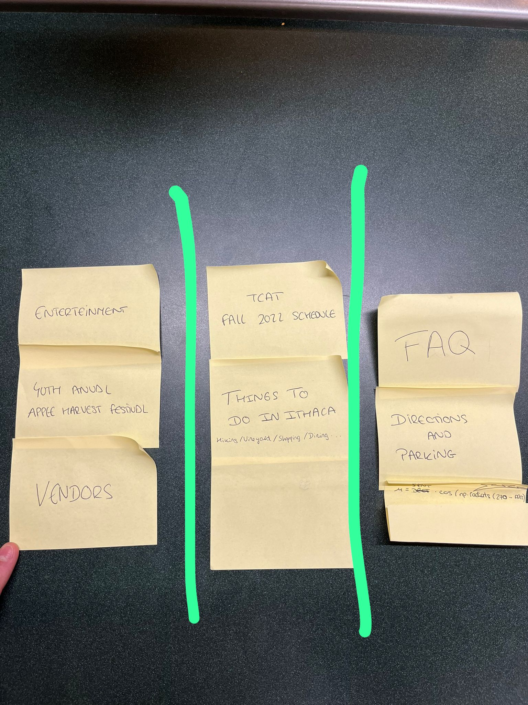
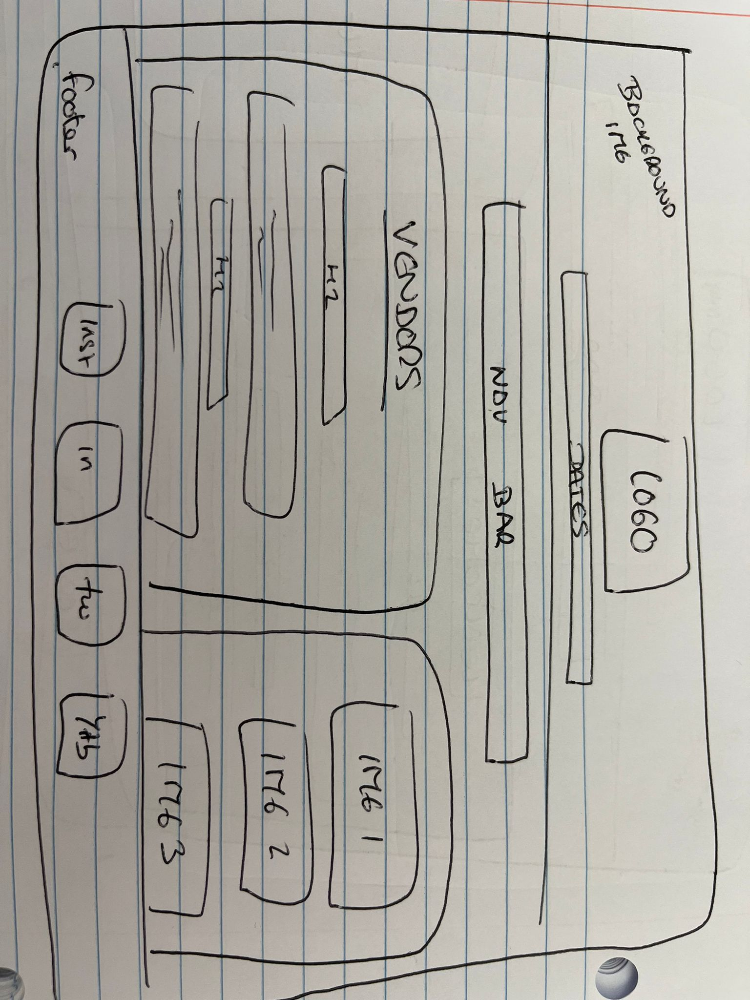
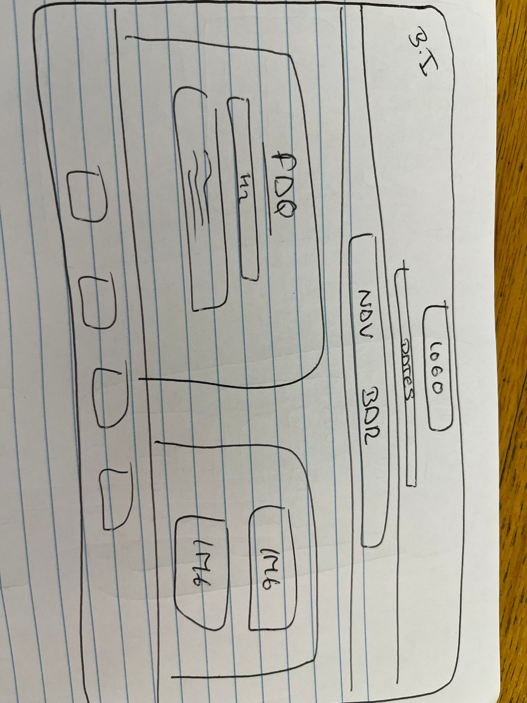

# Project 2: Design Journey

**For each milestone, complete only the sections that are labeled with that milestone.** Refine all sections before the final submission.

You are graded on your design process. If you later need to update your plan, **do not delete the original plan, leave it in place and append your new plan _below_ the original.** Then explain why you are changing your plan. Any time you update your plan, you're documenting your design process!

**Replace ALL _TODOs_ with your work.** (There should be no TODOs in the final submission.)

Be clear and concise in your writing. Bullets points are encouraged.

**Everything, including images, must be visible in _Markdown: Open Preview_.** If it's not visible in the Markdown preview, then we can't grade it. We also can't give you partial credit either. **Please make sure your design journey should is easy to read for the grader;** in Markdown preview the question _and_ answer should have a blank line between them.

## Understanding Users (Milestone 1)

**Make the case for your decisions using concepts from class, as well as other design principles, theories, examples, and cases from outside of class.**

You can use bullet points and lists, or full paragraphs, or a combo, whichever is appropriate. The writing should be solid draft quality but doesn't have to be fancy.

### User Interview Questions (Milestone 1)
> Plan the user interview which you'll use to identify the goals of your site's audience.
> You may use the interview template below and revise it as much as you desire.
> You are **required to author 3 of your own questions**.

**User Interview Briefing & Consent:** Hi, I am a student at Cornell University. I'm currently taking a class on web design and for a project, I am re-designing the website for Ithaca's Apple Harvest Festival. I'm trying to learn more about the people that might use this site. May I ask you a few questions? It will take about 10 minutes. You are free to quit at any time.

(These questions assume you are interviewing a festival attendee at the festival. If you didn't attend the festival, you may revise the questions and instead ask the participant to recall the last festival/event they attended. Do not ask them to speculate about visiting the Apple Harvest Festival. User speculation provides biased data.)

1. Please tell me a bit about yourself. You may omit any personal or private information.

2. What brought you to visit the Apple Harvest Festival today?

3. Before you came to the festival today, did you seek out any information about the festival before getting here?
3a. If yes, What information were you specifically looking for? Did you find it? How did you access that information?

4. When you arrived at the festival, did you seek out any information about the festival?
4a. If yes, What was that information? How did you obtain it?

5. Now that you're here participating in the festival, have you sought out information about the festival?
5a. If yes, Was it easy to find the information you where looking for?

6. Based on your experience today, what surprised you the most from the festival?

7. Is there anything you would have liked to know prior to coming to the festival? Maybe something that could be integrated in the apple harvest festival website?

8. As a visitor of the apple harvest festival 2022, Is there anything I haven't asked you today that you think would be valuable for me to know?

**After the interview:** This was really helpful. Thank you so much for agreeing to speak with me today. Have a great day!

### Interview Notes (Milestone 1)
> Interview at least 3 people from your audience. Take notes and include those notes here. Make sure to include a brief description of each interviewee.
> **Copy the interview questions above into each interviewee section below.**
> Take notes for each participant inline with the questions.

**Interviewee 1:**

My first interviewee was (60-70) years old lady who was visiting ithaca with her husband. Her and her husband where thinking about moving to Ithaca from Ohio for retirement. Hence, they did not come to Ithaca specifically for the apple harvest festival.

1. Please tell me a bit about yourself. You may omit any personal or private information.

I am visiting ithaca with my husband. Me and my husband where thinking about moving to Ithaca from Ohio for retirement. Hence, we did not come to Ithaca specifically for the apple harvest festival.

2. What brought you to visit the Apple Harvest Festival today?

When planing the itinerary for their visit to Ithaca, we wanted to find special events that were going on in town and looked at the calendar in the "Visit Ithaca Website", where we saw the harvest festival was happening during the days of our short stay.

1. Before you came to the festival today, did you seek out any information about the festival before getting here?

Yes

3a. If yes, What information were you specifically looking for? Did you find it? How did you access that information?

We were looking for general informationa bout the festival, and found everything in the "visit ithaca website", since there was no link from it to the apple harvest festival website. For this reason, we did not find all the information we would have liked to (never got to the apple harvest festival website).

4. When you arrived at the festival, did you seek out any information about the festival?

Yes

4a. If yes, What was that information? How did you obtain it?

We wanted to know about the layout of the shops at the festival, and found out hearing and asking people around us.

5. Now that you're here participating in the festival, have you sought out information about the festival?

No

5a. If yes, Was it easy to find the information you where looking for?

6. Based on your experience today, what surprised you the most from the festival?

The apple and the large number of different ways apples where being sold. The donuts, and the artisans.

7. Is there anything you would have liked to know prior to coming to the festival? Maybe something that could be integrated in the apple harvest festival website?

Defenetely, we had to ask people around to find specific shops. It would have been great to have a map either on paper or digital.

8.  As a visitor of the apple harvest festival 2022, Is there anything I haven't asked you today that you think would be valuable for me to know?

We just have one recommendation, that is, to link the apple harvest festival website from the visit ithaca website.

**Interviewee 2:**

We saw our second interviewee in front of the park looking at how his children played in the swings. We approched him. Lives in Ithaca, and works as a law professor in Ithaca College.

1. Please tell me a bit about yourself. You may omit any personal or private information.

I live in Ithaca with my wife and my two kids. I work as a professor in law at Ithaca College.

2. What brought you to visit the Apple Harvest Festival today?

I had known about the festival for a long time, and decided to visit it this year with my kids so that they could play with their friends in the park.

3. Before you came to the festival today, did you seek out any information about the festival before getting here?

I did not, because i had worked in the festival in the past and felt like I knew everything I needed to know.

3a. If yes, What information were you specifically looking for? Did you find it? How did you access that information?

4. When you arrived at the festival, did you seek out any information about the festival?

I didn't, again I had worked here so I knew how everything was.

4a. If yes, What was that information? How did you obtain it?

5. Now that you're here participating in the festival, have you sought out information about the festival?

When I came with my kids, I wanted to show them around the greatest shops in the festival. So I wanted to know where each section of shops were situated.

5a. If yes, Was it easy to find the information you where looking for?

It was not easy since no layout was provided about the fetival dsitribution of shops, and we had to ask people around us.

6. Based on your experience today, what surprised you the most from the festival?

Honest donuts surprised me a lot, but dont try them if you are diabetic.

7. Is there anything you would have liked to know prior to coming to the festival? Maybe something that could be integrated in the apple harvest festival website?

Yes, I would have liked to know how many and which vendors are environmentally conscious. Also, it would have been great to have a map at hand to know about the shops layout. Also, parking is always an issue, so directions and information for the parking would have been great.

8.  As a visitor of the apple harvest festival 2022, Is there anything I haven't asked you today that you think would be valuable for me to know?

I believe you pretty much asked everything, thank you.

**Interviewee 3:**

Our final interviewees where a group of three ithaca college students, two girls and one boy.

1. Please tell me a bit about yourself. You may omit any personal or private information.

We are Ithaca College Students, the three of us were born in Ithaca.

2. What brought you to visit the Apple Harvest Festival today?

We could not make it last year and we heard the food was amazing this year. Also, it is a tradition to come if you are from Ithaca, so we decided not to miss it this year again.

3. Before you came to the festival today, did you seek out any information about the festival before getting here?

Yes

3a. If yes, What information were you specifically looking for? Did you find it? How did you access that information?

We looked up the time when the festival closed to be able to fit it in our schedules. We found it at the "Downtown Ithaca Website".

4. When you arrived at the festival, did you seek out any information about the festival?

Yes.

4a. If yes, What was that information? How did you obtain it?

Once here we looked at most vendors and asked about information about the local people and the production process of what some of them sold.

5. Now that you're here participating in the festival, have you sought out information about the festival?

No

5a. If yes, Was it easy to find the information you where looking for?

6. Based on your experience today, what surprised you the most from the festival?

It is a really lively food atmosphere and everyone is so nice and eager to see what unqiue products local vendors are selling. Also, there is live music all weekend and we loved it.

7. Is there anything you would have liked to know prior to coming to the festival? Maybe something that could be integrated in the apple harvest festival website?

We would have liked to have more detailed information about the different local vendors that would be participating at the festival and about their products and their production process.

8. As a visitor of the apple harvest festival 2022, Is there anything I haven't asked you today that you think would be valuable for me to know?

You pretty much covered the most important staff. But I would like to recommend everyone to bring cash since most vendors wont accept payments in card.

### Goals (Milestone 1)
> Analyze your audience's goals from your notes above.
> List each goal below. There is no specific number of goals required for this, but you need enough to do the job (Hint: It's more than 1 and probably more than 2).

Goal 1: Give information about the layout of shops at the festival:

- **Design Ideas and Choices** _How will you meet those goals in your design?_
  - I will incorporate a section that offers a map with the complete layout of the festival.
- **Rationale & Additional Notes** _Justify your decisions; additional notes._
  - It is a need that most of my interviwees noted, and I believe it is a key thing to make accessible for customers considering the big size of the festival.

Goal 2: Give information about parking spots and access:

- **Design Ideas and Choices** _How will you meet those goals in your design?_
  - To approach this problem, we should see what parkings are available for the website, and incorporate the directions for arriving their (also taking into account the constructions and the deviation for traditional routes caused by the event).
- **Rationale & Additional Notes** _Justify your decisions; additional notes._
  - I would include this information in the same section where the map for the layout would be.

Goal 3: Make the apple harvest festival website more accessible for customers:

- **Design Ideas and Choices** _How will you meet those goals in your design?_
  - For this, we should find a way to contact the website owners of the most famous ithaca websites for them to include a link to the apple harvest festival website when talking about the festival as an event going on in ithaca. For example, the "visit ithaca website" or the "downtown ithaca website"
- **Rationale & Additional Notes** _Justify your decisions; additional notes._
  - It is an important need for customers since most of them dont get to our website, because they land in the others before.

Goal 4: Meet current necesity for customers to know about environmental consciusness of vendors:

- **Design Ideas and Choices** _How will you meet those goals in your design?_
  - We need to have more information about individual local vendors as well as on how environmental concsious they are.
- **Rationale & Additional Notes** _Justify your decisions; additional notes._
  - Depending on how much information we get about it, we could even create a ranking of environmental consciuosness. In this way helping the customers and making local vendors become more conscious.

Goal 5: Incorporate a list of recommendations as a section in the website:

- **Design Ideas and Choices** _How will you meet those goals in your design?_
  - As means to meet all the above mentioned goals, we will create a section in the website called "Recommendations" where most of the information a customer needs to know before visiting the festival will be.
- **Rationale & Additional Notes** _Justify your decisions; additional notes._
  - As seen in the interviewes, there are some things where all of the participants agree, and those are usually things they would have liked to know before going to the festival.

### Audience (Milestone 1)
> Briefly explain your site's audience.
> Be specific and justify why this audience is a **cohesive** group with regard to the Ithaca Apple Harvest Festival. .

Even in the reduced group of participants that we were able to interview during the festival, we found out that most of the people are from different places and ages. However, we have discovered that people usually visit the Ithaca apple harvest festival for the same reason, that is: Doing a fun social activity with friends/family/couples... while enjoying a beautyful atmosphere, having great food, and getting to know what local vendors produce.

Therefore, our audience could be described as: Ithaca residents and visitors from all ages and backgrounds who share the curiosity to find more about local vendors and seek to have fun and enjoy of a great and friendly atmosphere while having wonderful food.

## Festival/Event Website Design Exploration (Milestone 1)

Identify three festival or event websites (preferably static websites) that exist today on the web. You will be drawing inspiration from these sites for your own site; please select websites that are similar to the website you wish to create.

Include two screenshots of the home page for each site: narrow and wide.

**We'll refer to these are your "example websites."**

1. <[Long Island Fall Fest url](https://lifallfestival.com/)>

    

    

2. <[Kings County Fest](https://www.kingscountyfiberfestival.org/)>

    

    

3. <[NY Coffee Fest](https://www.coffeefest.com/new-york)>

    

    

### Festival/Event Website 1 Review (Milestone 1)
> Review the website you identified above. (1 paragraph)
> In your review, include a discussion common design patterns in the site.

The Long Island Fall Festival Website is a very complete one. It consists on 7 webpages, with a navigation bar situated on the top right part besides the logo of the festival. They icnlude a Map secttion with the layout of the vendors, and also a vendors section with descriptions and informationa bout the different local vendors that there will be in this year's festival. Finally, they have a webpage with inidcations about parking spots, and directions about accesibility to them.
Both narrow and wide layouts seem usable and appropiate, since in the narrow we get more arrows and display blocks to save up space.

### Festival/Event Website 2 Review (Milestone 1)
> Review the website you identified above. (1 paragraph)
> In your review, include a discussion common design patterns in the site.

The Kings County Festival website does not look as professional as the Long Island Fall Festival. But, even though it looks like it only has 4 webpages, if you situate the cursor on top of any webpage in the navigation bar, an extended subnavigation bar will appear. Talking about information, they are the website with the most detail information about vendors, and also include a vendor map with the layout of the festival, which are both somethings that out participants in the interviews would have liked to have. The most clear thing that I am missing is that they do not provide the customer with any information about parkings.
Both narrow and wide layouts seem usable and appropiate, since in the narrow we get more arrows and display blocks to save up space, while in the wide layout the navigation bar appear completely without displaying any block.

### Festival/Event Website 3 Review (Milestone 1)
> Review the website you identified above. (1 paragraph)
> In your review, include a discussion common design patterns in the site.

Finally, for the NY Coffee Festival, we can appreciate that the professionality level is superior in contrast to the other two websites. However, it is probably less aplicable and appropiate to the intention of our website for the apple harvest festival, since, even the concept of the festival is not the same. I am missing a map for the layout and more information about the vendors and the different shops in the festival.
Both narrow and wide layouts seem usable and appropiate, since in the narrow we get more arrows and display blocks to save up space, while in the wide layout the navigation bar appear completely without displaying any block.

## Content Planning (Milestone 1)

Plan your site's content.

### Your Site's Planned Content (Milestone 1)
> List **all** the content you plan to include your personal website.
> You should list all types of content you planned to include (i.e. text, photos, images, etc.)

In order to tackle the content section, I would like to use the content provided by the course materials, since I find it complete and professional, apart from applicable to my audience. However I will add some pictures that I took while doing the interviewes when I visited the Apple Harvest Festival, to give it more of a personal touch. Therefore following the logic of the given content, I will include text in the form of information about the festival itself (vendors, schedule, history of the festival, parking directions...) as well as more ithaca entertainment for those who are visitors and new in town, where I will show the most attractive acitivities to do while in Ithaca. Finally, I will include some frequently asked questions.

Apart from the pictures I commented I will add, I will also include the dates the festival is happening, the location, and some contact information where visitors can reach out with any questions.

### Content Justification (Milestone 1)
> Explain (about a paragraph) why this content is the right content for your site's audience and how the content addresses their goals.

First of all, as we found out when running the interviews, there are some common things that my participants all agreed upon. Those where ussually things that they would have liked to know prior to their visit to the festival, such as what to bring with them, where to park, how much money to bring, whether they had to bring cash... For that reason, the FaQ and parking/direction sections are key to satisfy my audience needs. Furthermore, participants in my interviews also would have liekd to have mroe information about the local vendors and about their production processes, for that reason, y will include a whole section dedicated to meet this necesity. Finally, I will add an enterteinment in ithaca section for those festival visitors that come from outside the city, who, as found out in my visit, are a big portion of the audience, therefore, if they have a resource in the same website where to see what else can be done and visited in town may be the key factor for them to take the decision of coming.

## Information Architecture (Milestone 1)

### Content Organization (Milestone 1)
> Document your **iterations** of card sorting here. You must have at least 2 iterations of card sorting.
> Include photographic evidence of each iteration of card sorting **and** description of your thought process for each iteration.
> Please physically sort cards; please don't try and do this digitally.

In this first card sorting iteration I thought about creating four webpages, the first one would be dedicated to the festival itself, with information such as the history, the enterteinment, and the directions of the parking, so that general visitors can see that straight away, the second page would be vendors, I decided to dedicate a whole page of this, since I consider the audience values a lot to know the origin of the products and to know more about local vendors (what the festival is all about in the end). Finally, a webpage for frequently asked questions will be included at the end.

In contrast to the first iteration, in this one I decided to put togehter the general information section and the vendors in the same webpage, and I took parking directions outside from it and brought it to the FAQ questions as the audience will like to know about directions once they have taken the decision of attending the festival. Finally, the things to do in ithaca and the tcat buses will be together, since the buses schedule will also be used for those visitors who would like to know ithaca mroe in depth and not only attending the apple harvest festival.

)

### Final Content Organization (Milestone 1)
> Which iteration of card sorting will you use for your website?

tell us which iteration of card sorting you plan to use.

I will proceed and use the first iteration.

> Explain how the final organization of content is appropriate for your site's audiences.

why does this organization make sense for your audience (not you)?

The iteration makes sence, since. In my opinion, from what I learned from participants and visitants in the festival, people ussually like to know about the vendors in depth, and I felt like one of the biggest things that where missing in the visitants minds was more information about the production processes and origins of local vendors, therefore having onw page dedicated to them is crucial for my audience. Secondly, the about page where all information about the history of the festival as well as the hours and the parking direction should be together since it is all related to make the audience know how the festival works and how to move around. Furthermore, the things to do in ithaca has to go together with the TCAT buses since the buses will be most used by those visitors who come from outside the city, who are at the same time those interested in knowing what tourism can be done in ithaca. Finally, the FaQ section has an individual page for those customers who have already decided to attend the festival and want to know how prepared they have to go and what they need to know before attending, one thing that many participants of my interviewes woud have liked to have.

### Navigation (Milestone 1)
> Please list the pages you will include in your website's navigation.

- Home
- About
- Vendors
- Ithaca
- FAQ

> Explain why the names of these pages make sense for your site's audience.

First of all, all pages where named following the reason that a webpage name has to be explanatory, and has to describe the content that it will have inside, therefore:

The audience of any website always expect to see an about website where to see the main purpose of the same, and to see what it is that the website is for. Secondly, the vendors website has to be catchy and direct, so that the audience will straightly know where to go if they want to meet the vendors in depth. Ithaca is a name that englobes both ithaca tourism and how to move around the town. And FAQ section is clear and quick for the audience to see and know about it.

## Visual Theme (Milestone 1)
> Discuss several (more than two) ideas about styling your site's theme. Explain why the theme ideas are appropriate for your target audiences. Note the theme you selected for your site and why it's appropriate for the audience and their goals.

Theme Ideas and Rationale:

Idea 1: The first theme Idea I came up with was to make the website have fall as the main theme, including autumn colours all over the website, such as different intensities of browns and greens, as well as including apples as background pictures in some cases.

Idea 2: The second idea would be to instead of following a reasoning that has to do with the season of the year, would be more based in what is sold in the festival, the food, and the vendors themselves. To do this, apples and local vendors will be the theme guiders. Having backgroudns with many fruits and including many pictures and colours about vendors will be key.

Idea 3: Finally, the last option would be to make the website more impersonal and more profesional, of course including pictures about fall, the vendors and the food, but keeping a more professional theme with unique coloured backgrounds and more blacks browns and whites.

Final theme: I decided to go for the first idea. The fall theme, since I believe this one to be more attractive to the audience of the apple harvest festival.

## Design (Milestone 1)

Document your site's layout.

### Layout Exploration (Milestone 1)
> Iterate on your site's design through sketching.
> Sketch both the narrow and wide versions of the site.
> Here you are just exploring your layout ideas. You don't need to sketch every page.
> Provide an explanation for each sketch explaining the idea and the design patterns you are leveraging.

LAYOUT 1:

In this first layout idea I decided to place the navigation bar on the top close to the logo of the festival, to separate it from the rest of the page, where I include on the bottom the date, location and contact, as it is more secondary information for the audience knowledge.

LAYOUT 2: In this case, I did put the logo and navagation abr at the top, but I used the rest of the space diferently, I include, apart from the abckground picture, another picture on one side, an the dates, lcoation and contact info in the other, so that all the content is more unified and center in the page.

LAYOUT 3: The final layout idea was more focus on its application and adaptability to the narrow site. Since I am including two separation lines, one is the existing in the other two layouts, and I add one on the left, to separate the extra information, I leave the rest of the space for images. Which, in myopinion is what the audience will want to see in a welcome/home page

### Final Design (Milestone 1)
> Include the final sketches for each of your pages.
> The sketches must include enough detail that another 1300 student could implement them.
> Provide an explanation for each sketch.

**Narrow (Mobile) Design:**

In the home page, as well as in the rest of the narrow webpages, I include the logo on the top, with the dates below it, and both of them with a background image of apples. Below that, the navigation bar will be drawn. Then, the content will be above the images for each webpage, and on the bottom, there will be a footer with the contact information.

Following the same structure, I included some images below the content, ahd kept the rest equal.

Following the same structure, I included some images below the content, ahd kept the rest equal.

Following the same structure, I included some images below the content, ahd kept the rest equal.

Following the same structure, I included some images below the content, ahd kept the rest equal.

**Wide (Wide) Design:**

I kept the same structure for all the webpages: The logo will appear centered on top, with the dates of the festivla just below it. Those to items will have a background image. Below that, I set the navigation bar. Later on, with a flexbox, I will keep the written content on the left, and the corresponing images on the right. On the botton, there will be a footer included with the contact and social media information.

For the wide design, following the logic of the homepage, I included the text on the left, and the images related to the webpage on the right to use up all the space efficiently.

)

For the wide design, following the logic of the homepage, I included the text on the left, and the images related to the webpage on the right to use up all the space efficiently.

For the wide design, following the logic of the homepage, I included the text on the left, and the images related to the webpage on the right to use up all the space efficiently.

)

For the wide design, following the logic of the homepage, I included the text on the left, and the images related to the webpage on the right to use up all the space efficiently.

### Design Rationale (Milestone 1)
> Explain why your design is appropriate for your audience.
> Specially, why does your content organization, navigation, and site design/layout meet the goals of your users?
> How did you employ **design patterns** to improve the familiarity of the site for your audience?

In the layout and desgin of my assignment, I at all moments had in mind the feedback that I heard at the interviewes I developped during the apple harvest festival. I got the feeling that people like the fall sensation that the festival arises on everybode, and everyone is social and looks to ahve fun, for that reason the background picture is there in all webpages both narrow and wide. About the content being on the right and images on the left, I believe my audience will like to always have images to look while reading text instead of only having words and more words. The whole point of my design is to make it informational and attractive to my audience. Also, the fact that the navigation bar will be put in between the content of a certain page and the logo of the festival will give my audience the opportunity to always be seeing the navigation bar in the middle of the screen, which will allow them to move around the website easier.

## User Testing (Final Submission)

### User Testing Tasks (Final Submission)
> Plan out your user testing tasks before doing your user testing.
> These must be actual user testing tasks.
> **Tasks are not questions!**

1. You are really into jazz, and you know Ageless Jazz Band will be playing live during the apple harvest festival for some time. This weekend the festival is finally here. However, you have 3 deliverables at Cornell next week, so you have met with your group on Sunday from 9am to 11am on Campus. Check whether that will make it impossible four you to attend the Noon Ageless Jazz Band concert at Bernie Milton Pavillon.

2. Find out whether you need to bring cash to the festival.

### Participant 1 (Final Submission)
> Using your notes from above, describe your user by answering the questions below.

1. Who is your user, e.g., where does the user come from, what is the user's job, characteristics, etc.?

    My first user is one of my best friends here at Cornell. He is from Spain and is here on exchange. He studies engenieering, and his family is a big producer of apples in Spain.

2. Does the user belong to your audience of the site?

    > If “No”, what’s your strategy of associating the user test results to your audience’s needs and wants? How can your re-design choices based on the user tests make a better fit for the audience?

    The first user is does not belong to the target audience of the site. However, given that his family works in the apple production sector, I thought it would be of great interest for the festival to have an external opinion of the website from someone who has knowledge on the subject. Prior to the test, I believe he will be able to help us re-desing the vendors webpages if needed, so that the audience that is really interested in the productions of the items sold at the festival can be targeted more precisely.

### Participant 1 -- Testing Notes (Final Submission)
> When conducting user testing, you should take notes during the test.

First Task: He first went to the home page where he show the dates but not the hours of the festival, then he changed to the about page, scrolled down, and found out about the enterteinment section, where he saw the concert of interest started one hour after his meeting finished, therefore his answer was that he would be able to attend the concert.

Second Task: He said he was experienced visiting websites and imagiend that this question would appear in the FAQ page, therefore went there directly and found the question "can I pay with a credit card".

### Participant 2 (Final Submission)
> Using your notes from above, describe your user by answering the questions below.

1. Who is your user, e.g., where does the user come from, what is the user's job, characteristics, etc.?

    I went to the barbershop yesterday, and after talking with the barber for a while, I found out he did not only visit the festival this year, but that it is actually an acitivity that he does one year after the other.

2. Does the user belong to your audience of the site?

    > If “No”, what’s your strategy of associating the user test results to your audience’s needs and wants? How can your re-design choices based on the user tests make a better fit for the audience?

    Yes, the user belongs to the target audience of the website, since he is an ithaca resident that is interested in the artisanal production of apples and really enjoys visiting the festival every year. Given his experience in the festival, it will be great to here the opinion of one of our potential clients testing our website.

### Participant 2 -- Testing Notes (Final Submission)
> When conducting user testing, you should take notes during the test.

First task: The user started with the following reasoning: this information should be either in the home page or in the about page, then he saw it was not in the home page and moved on to the about page, when, scrolling down found out the enterteinment section, and was able to see when the concert was and that he would be able to attend inspite of his meeting.

Second Task: The user first of all was surprised that this task was asked since it was a question that he had heard from foreign visitors in past years during the festival. Again for this user it was pretty straight forward to fin the question under the FAQ webpage.

### Participant 3 (Final Submission)
> Using your notes from above, describe your user by answering the questions below.

1. Who is your user, e.g., where does the user come from, what is the user's job, characteristics, etc.?

    My third and last user is a 17 year old kid, who was doing his last year of school in Ithaca. I went to the commons with the objective of finding someone of similar characteristics.

2. Does the user belong to your audience of the site?

    > If “No”, what’s your strategy of associating the user test results to your audience’s needs and wants? How can your re-design choices based on the user tests make a better fit for the audience?

    Despite of being an ithaca resident, the user does not belong to the target audience of the website. However, his results can be key for the designers to know what to change since the opinion of a milenial in a user interface challenge is always important, since they are supposed to be the best users of technology.

### Participant 3 -- Testing Notes (Final Submission)
> When conducting user testing, you should take notes during the test.

First task: I believe my user was confused when I dropped the question, so I made sure he understood the objective. Then, he started moving from page to page in the site, and found the dates and hours of the festival. However, he was not able to find out were the hours for the concert were mentioned, thus he could not give me an answer.

Second task: This time it took some more time for the user to find the answer to the task than for the other two users. However, he eventually found the question under the FAQ page and told me the answer.

### Potential Changes Based on User Testing (Final Submission)
> What changes would you make to your design based on user testing?
> Note: You are not required to change your design. Simply tell  us what you would change.

After conducting the user testing, and letting three people from different backgrounds and needs, I came to realize the website does a pretty good job on guiding users to find what they have come to look for. However, the first task was a bit more challenging. Therefore I have decided that a potential update in the website could be to add a brief description of the enterteinment section under its title, as well as making the titles of the sections stand out more, either through some border, or maybe with a background colour that highlights it.

## Rationale (Final Submission)

**This rationale should be polished writing:** one you might submit as a report to a client or boss to help explain the project and convince them you did a good job. You'll be surprised how much writing and communicating you need to do about projects and choices on internships and jobs; practice that here.

It should be a comprehensive, complete story of the project. You might find that each section runs about a paragraph. Sketches can often help tell the story of your design.

Your rationale should be a polished version of the earlier explanations.

### Audience (Final Submission)
> A complete and polished description of the intended audience(s) for your website.

This project started two or three days before the Apple Harvest Festival 2022 started. Therefore, I took the opportunity of going to the festival to gather some perceptions and thoughts, as well as to ask attendants about their opinions on the festival. At the beigining of this report I included the interview questions and their responses, which had a tremendous effect in the design of the audience and hence of the website. After doing this, I got to decide a specific group of people towards which my ultimate design should be targeted:

Ithaca residents and visitors from all ages and backgrounds who share the curiosity to find more about local vendors and seek to have fun and enjoy a friendly and healthy atmosphere.

### Audience Goals
> Explain how your site's design addresses the goals of the audience.

There are different objectives my target audience will have when visiting the website, and they will also depend on the demographics of the visitor, on wether they are ithaca residents or visitors, and in many different things. Generally, the audience will visit the website with a previous knowledge on what the festival is all about, since most of them have even visited it on previous years. For this reason, my audience will look for extra information, that is, dates, times, frequently asked questions, special guests and vendors of this year. That is, all in all the audience will specially be looking for the extra/new services and activities that the festival offers in 2022 as opposed to previous years. For this reason, my website includes detailed information about vendors, as well as contact information, parking resources and indications, the layout map of the festival, FAQ... and many more things to meet the needs of my target audience.

### Visual Design (Final Submission)
> An explanation of how the final design is appropriate for your audience.
> Include design patterns in your rationale.

First of all, one of the most important aspects of the design is the theme that I gave to the website in the form of background colours, images, fonts and colours, since given the season of the year the festival happens in, and the mood the audience has when visiting the website, I believe this theme will be attractive to the target audience. Moreover, the website has a different desgin for narrow and wide screens, which makes it more flexible for the audience to visit the website on difference devices. Furthermroe, according to the visitors I interviewed during the festival, having images in the website makes them feel like wanting to go the festival. It also helps them to really get a sense of how the festival works and to know what they can expect. That is why I decided to add lots of images in every website, each image related to the content of the webpage it is in. Finally, it is key for a client to be able to contact the company as well as to see their presence on social media, therefore I created a footer where I added the links to their main social media accounts, and I added them inside a logo of the social medias themselves, to catch the attention of the audience. Finally, coming back to the roots, I decided to add the logo of the festival and the dates on which it is happening on the top of every webpage so that the audience can always scroll up and see when it is happening no matter the page they are in.

### Self-Reflection (Final Submission)
> Take some time here to reflect on how much you've learned since you started this class. It's often easy to ignore our own progress. Take a moment and think about your accomplishments in this class. Hopefully you'll recognize that you've accomplished a lot and that you should be very proud of those accomplishments!

I like the way the question is asked, since it is true that it is easy to ignore our own progress. However, taking perspective I realize that 2 months ago I did not know how to write one single HTML nor CSS command, and I have just build an entire webpage from scracth. I am really enjoying the time of this course and its projects, as well as learning a lot.

## Grading (Final Submission)

### Collaborators
> List any persons you collaborated with on this project.

I collaborated only with the festival participants that I interviewed and the users that completed my user testing.

### Reference Resources
> Please cite any external resources you referenced in the creation of your project.
> (i.e. W3Schools, StackOverflow, Mozilla, etc.)

In the creation of my project, I used help from some external resources: Mozilla, W3Schools, StackOverflow.
